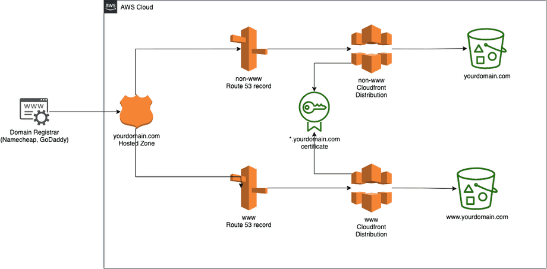

# Host static website on S3

# overview

See [this blog](https://www.alexhyett.com/terraform-s3-static-website-hosting#terraform-command-to-deploy-our-infrastructure) for more info


# setup

- Install terraform (v0.14.5 is used for this project)
- Make sure you have an AWS account, and a domain (I bought one on [AWS route53](https://docs.aws.amazon.com/Route53/latest/DeveloperGuide/domain-register.html#domain-register-procedure))
- I use [aws-vault](https://github.com/99designs/aws-vault) for handling the AWS credentials.
- [pipenv](https://pypi.org/project/pipenv/) to handle python dependencies

# to upload new website code

first sync all files with the s3 bucket

```
cd src
aws-vault exec <profile> aws s3 sync . <your bucket>
```

Then invalidate the cloudfront cache, unless the change is minor and you don't mind the old version sticking around for a while

```
aws-vault exec <profile> python3 invalidate_cloudfront_cache.py
```

# AWS region

I choose Ireland based on:
https://www.concurrencylabs.com/blog/choose-your-aws-region-wisely/

### Very grateful for these resources

[Alex Hyett, Hosting a Secure Static Website on AWS S3 using Terraform (Step By Step Guide)](https://www.alexhyett.com/terraform-s3-static-website-hosting#terraform-command-to-deploy-our-infrastructure)

[Jeremy Olexa, Invalidate CloudFront Cache with boto3](https://gist.github.com/jolexa/e58ea2ec19cf3067d0ddfbdc98bbaf6d)
